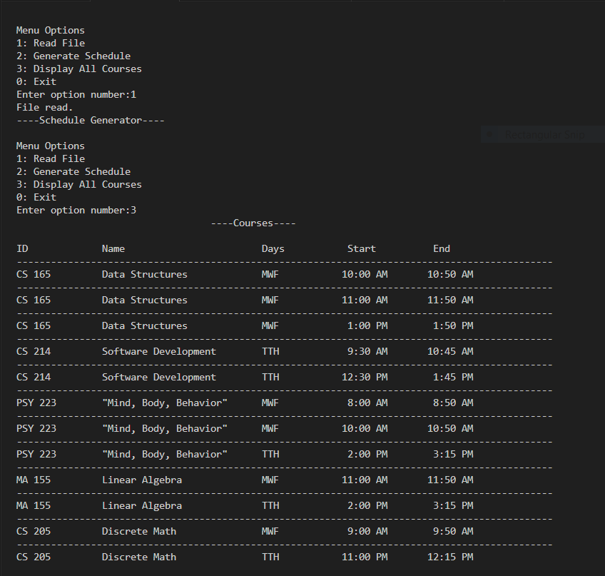
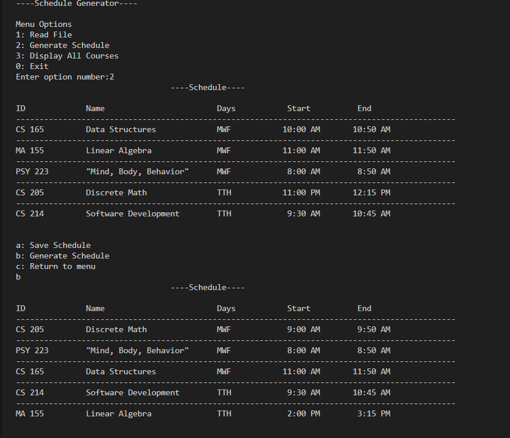
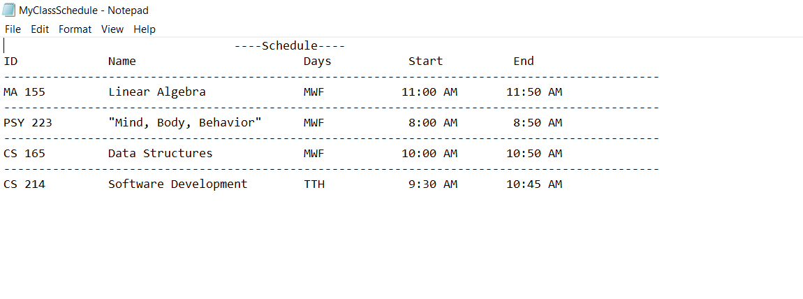

# Schedule Generator

This project is a console app that reads a CSV file with class information(IDs, class names, days, start & end times) allowing users to generate a schedule based on classes available. There's a limit of eight classes so if there are more than eight unique courses, only eight will be picked. 

The program also allows users to save their schedule once they are satisfied with the courses picked. The picked courses are written to a new txt file.

# Screenshots

